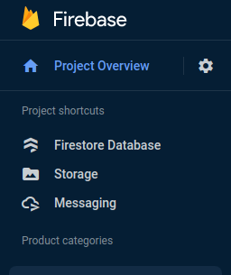
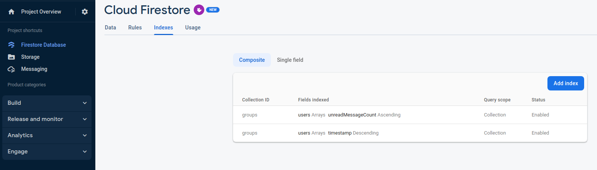

This package uses `cloud_firestore`,`firebase_messaging` and `firebase_storage`. So you must enable this services from your [Firebase Console](https://console.firebase.google.com/). You can enable them by clicking on each of these services and following the steps shown by firebase console.

## Add indexes in Cloud Firestore

Cloud Firestore ensures query performance by requiring an index for every query. The indexes required for the most basic queries are automatically created for you. But for more complex queries you need to create composite indexes. Add the indexes shown in the below image to your project. If you run the project without creating indexes it will throw exception and it will also print a link in the console from which you can create index.

